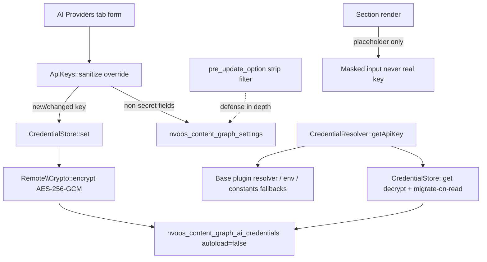

# Credential Storage — Review & Enhancement Plan

> **Date:** 2026-08-31
> **Status:** ✅ Implemented (Phases 1–5). See `CHANGELOG.md` 1.0.4. One design deviation from the original plan: `CredentialStore::set()` writes only the credentials option — the settings option is cleaned by the in-flight `pre_update_option` filter and by `migrateAll()`/`get()` strip steps. (Writing settings synchronously from inside a save re-enters the filter against stale DB state and loops unboundedly when two or more secrets exist — caught by `Test_CredentialStore`.)
> **Scope:** How `plugins/nvoos-content-graph-ai` stores and manages the 13 AI provider API keys (plus the legacy core `openai_api_key`).
> **Question answered:** Does the base+pro plugin's credential treatment (separate non-autoload credentials option, AES-256-GCM encryption at rest, masked rendering) need to be replicated here? **Yes — and this plan defines how.**

---

## 1. Verdict (short answer)

The base+pro plugin (`mcp-ai-wpoos`) stores API keys **encrypted at rest** in a **separate non-autoload credentials option** (`wp_mcp_ai_credentials`), never renders them back into the admin form (masked placeholder instead), and resolves them through a single `WP_MCP_AI_Credential_Resolver` chain.

`nvoos-content-graph-ai` currently stores the same class of secrets **as plaintext** inside the shared `nvoos_content_graph_settings` option and **echoes them back into the admin HTML** (`value="sk-…"` in the password inputs). The read/resolution chain is already well designed (single `CredentialResolver`, delegation to the base plugin, env/constant fallbacks) — the **storage and rendering layers are the gaps**.

So: yes, the same treatment is needed. The changes are scoped almost entirely to the AI addon (plus two tiny, additive touches to the core plugin), because no core code reads `ai_api_key_*` directly.

---

## 2. Current state (verified against source)

### 2.1 Where keys live

| Key | Location | Stored as |
|---|---|---|
| 13 × `ai_api_key_{provider}` | `nvoos_content_graph_settings` option (via `ApiKeys.php` section fields) | **Plaintext** |
| Legacy `openai_api_key` (General → Build tab) | same option, core `Schema::defaultSettings()` | **Plaintext** |
| Remote-source credentials | `nvoos_content_graph_remote_sources.config_json` | Encrypted (`Remote\Crypto`, `gcm:` prefix) ✅ |

### 2.2 Write path (how keys get saved)

```
Settings form (AI Providers tab)
  → core SettingsPage::sanitizeSettings()            [plugins/nvoos-content-graph/src/Admin/SettingsPage.php]
    → ApiKeys::sanitize() (inherits core Section)    [plugins/nvoos-content-graph/src/Admin/Section.php]
      → sanitize_text_field() — no encryption
    → merged wholesale into nvoos_content_graph_settings
  → update_option(..., false)  (non-autoload — good)
```

### 2.3 Read path (already good, keep it)

```
ContentGraphSettingsStore::getApiKey()               [src/Adapter/ContentGraphSettingsStore.php]
  → CredentialResolver::getApiKey()                  [src/Adapter/CredentialResolver.php]
    1. nvoos_content_graph_settings → ai_api_key_{provider}   ← plaintext read today
    1b. nvoos_content_graph_settings → openai_api_key (legacy)
    2. WP_MCP_AI_Credential_Resolver (base plugin: wp_mcp_ai_credentials + WP 7.0 Connector DB)
    3. {PROVIDER}_API_KEY env var
    4. {PROVIDER}_API_KEY constant
```

### 2.4 Confirmed gaps (each is a real finding)

1. **Plaintext at rest** — 13 keys (+1 legacy) stored unencrypted in `wp_options`. A DB dump, `wp option get`, or a compromised SQLi read leaks every provider key.
2. **Keys echoed to the browser** — core `Section::render_field()` renders `value="' . esc_attr( $value ) . '"` with the *real* key. The key is present in the settings-page HTML source of every admin who can view it.
3. **No placeholder/mask semantics** — the base plugin uses `MASKED_SECRET_PLACEHOLDER` and preserves the stored value when the placeholder is submitted. Here, submitting an untouched tab posts `''` and wipes typed values; submitting with a re-rendered key re-stores plaintext.
4. **No separate credentials option** — secrets share an option that the core plugin rewrites wholesale on every save. (The base plugin had exactly this class of bug: issue #5685 — a tab save wiping other providers' keys.)
5. **No migration path / no tooling** — no upgrade routine, no WP-CLI command, no admin indicator showing *which source* supplied a key (the resolver has `getKeySource()` but nothing consumes it in the UI).
6. **No audit logging** — key store events are silent.

### 2.5 Verified non-issues (do not "fix")

- REST endpoints (`ChatController`) expose only `configured: bool` — never key values. ✅
- The settings option is already non-autoload (`update_option(..., false)`). ✅
- Env-var/constant fallbacks and base-plugin delegation already exist. ✅
- Core plugin never reads `ai_api_key_*` directly (only the legacy `openai_api_key` default + field definition in `BuildSection`). ✅ — this is why the change can live in the addon.

---

## 3. Reference architecture (base+pro, what we mirror)

| Concern | Base+pro implementation |
|---|---|
| Storage split | `wp_mcp_ai_credentials` (autoload=false) vs `wp_mcp_ai_settings` (autoload=true); `get_settings()` merges at read time |
| Encryption | `WP_MCP_AI_Encryption` — AES-256-GCM, `v2:` prefix, master key from `WP_MCP_AI_MASTER_KEY` constant or `wp_mcp_ai_master_key` option |
| Key store API | `WP_MCP_AI_Api_Key_Store` — get/set/delete + **transparent plaintext→encrypted migration on first read** + `migrate_all()` |
| Masking | `MASKED_SECRET_PLACEHOLDER` — stored value never re-rendered; placeholder submission = "keep existing" |
| Resolution | `WP_MCP_AI_Credential_Resolver` — settings → WP 7.0 Connector DB → env → constant |
| Save hardening | STEP 6 split in `handle_save_settings()`; "never delete credentials option" rule |

The addon mirrors **all six rows**, reusing the ecosystem's existing crypto primitive where possible (see §4.2).

---

## 4. Target design

### 4.1 Data flow after the change



### 4.2 Encryption engine decision

**Recommendation: reuse the parent plugin's `NvoosContentGraph\Remote\Crypto`** (`plugins/nvoos-content-graph/src/Remote/Crypto.php`).

- The parent plugin is a hard dependency (`Requires Plugins: nvoos-content-graph`), so the class is always available.
- It already implements AES-256-GCM with `gcm:`/`b64:` prefixes, transparent legacy-plaintext decryption, and an OpenSSL-availability check (`isAvailable()` + fallback + admin notice pattern).
- Key is derived from `AUTH_KEY`/`SECURE_AUTH_KEY` — no new master key to store or back up.
- One crypto implementation in the ecosystem; identical to how remote-source credentials are already protected in the core.

**Alternatives considered (and rejected for v1):**
- *Delegate to `WP_MCP_AI_Encryption` when the base plugin is active* — byte-identical to base+pro but introduces a second engine and a behavior cliff when the base plugin is deactivated (keys unreadable). The formats are independent, so nothing is gained.
- *Ship a standalone crypto class in the addon* — duplicates code the parent already ships; only worth revisiting if the addon ever drops the parent dependency.

**Known trade-off to document:** `Remote\Crypto` derives its key from WP salts. If salts rotate (or the site is cloned with new salts), stored keys cannot be decrypted. `Crypto::decrypt()` then returns the original ciphertext → the resolver would forward garbage to the provider. Mitigation: `CredentialStore::get()` detects "decrypt returned an undecrypted value" and treats it as missing + logs `decrypt_failed` (admin re-enters the key). Document in README + a Site Health/status note.

### 4.3 New option

`nvoos_content_graph_ai_credentials` — array of `provider_slug => Crypto::encrypt( key )`, stored `autoload=false`.

- Only the 13 `ai_api_key_*` values + the migrated legacy `openai_api_key` under key `openai`.
- Deleted only on uninstall (add `uninstall.php`); **never** on deactivation or on settings save (mirrors the base plugin's "never delete the credentials option" rule).

### 4.4 Masking placeholder

Use the same placeholder string as base+pro: `**************`. Semantics:

- Render: if `CredentialStore::has( $slug )` → input value = placeholder; else empty.
- Save: submitted value `=== placeholder` or `''` → keep existing (skip write); anything else → `CredentialStore::set()`.

---

## 5. Implementation plan (phased)

### Phase 1 — Crypto access + `CredentialStore` (new class)

**New file:** `plugins/nvoos-content-graph-ai/src/Security/CredentialStore.php`

- `const OPTION_NAME = 'nvoos_content_graph_ai_credentials';`
- `const MASKED_PLACEHOLDER = '**************';`
- `const MANAGED_KEYS` — the 13 provider slugs (mirror `ApiKeys::get_fields()` list, minus local/no-key providers is *not* done — store them too if entered, they're optional).
- `get( string $provider ): ?string`
  - read credentials option → `Crypto::decrypt()`.
  - **transparent migrate-on-read:** if absent from the credentials option but plaintext exists in `nvoos_content_graph_settings['ai_api_key_'.$provider]` (or legacy `openai_api_key` for `openai`), encrypt it into the credentials option and strip the plaintext key from the settings option.
  - `decrypt_failed` detection (ciphertext came back undecrypted) → log + return `null`.
- `set( string $provider, string $value ): bool` — empty value = `delete()`; otherwise `Crypto::encrypt()` and `update_option( ..., false )`.
- `delete()`, `has()`, `all_configured(): array` (for UI status), `migrate_all(): array{ migrated, failures }`.
- `static register(): void` — hooks:
  - `pre_update_option_nvoos_content_graph_settings` filter: strip any `ai_api_key_*` + `openai_api_key` keys from the incoming array before the core writes it (**defense in depth** — guarantees plaintext never re-enters the settings option regardless of save path).
  - `admin_notices` (or hook into parent's notice rendering): warn when `Crypto::isAvailable()` is false (keys would fall back to `b64:`) — mirror the parent's existing notice pattern.
- Guard everything with `function_exists('openssl_encrypt')` and class-exists checks so the addon still boots if the parent changes.

**Unit tests:** `tests/Integration/test-credential-store.php` — roundtrip set/get, delete, migrate-on-read from plaintext settings, placeholder semantics, `migrate_all()` count/failures, tampered ciphertext → `null`, `pre_update_option` strip filter.

### Phase 2 — Read-path swap + masked rendering

**Edit:** `src/Adapter/CredentialResolver.php`

- `fromContentGraphSettings()` → replace direct option reads with `CredentialStore::get( $provider )`.
- Legacy fallback: `CredentialStore::get( 'openai' )` (which itself checks the legacy bare `openai_api_key` location during migration); keep a final raw-option fallback read for the transition window only.
- `getKeySource()` → return `'credential_store'` (label: "Content Graph AI credentials") instead of `'content-graph_settings'`.
- Update class docblock priority chain (1 → credential store, 2 → base plugin, 3 → env, 4 → constant).

**Edit:** `src/Adapter/ContentGraphSettingsStore.php`

- `set()`/`delete()` route `ai_api_key_*` keys to `CredentialStore` instead of the settings option.
- `all()` unchanged (key fields no longer live in the settings option, so defaults apply).

**Edit:** `src/Admin/Sections/ApiKeys.php`

- Override `render()` / `render_field()` (protected, overridable): for `ai_api_key_*` fields render the **placeholder** when `CredentialStore::has()` is true, empty otherwise; keep `autocomplete="new-password"`.
- Override `sanitize( array $input ): array`:
  - non-secret fields → inherit core behavior (return them for the settings option).
  - secret fields → `''`/placeholder ⇒ skip; new value ⇒ `CredentialStore::set()` (side effect) and do **not** return the key into the settings merge.
- Add a per-field "stored via: {source}" hint using `CredentialResolver::getKeySource()` when the key came from base plugin/env/constant (nice-to-have in Phase 2, required for the Phase 4 notice work).

**Tiny core edit (additive, backward compatible):** `plugins/nvoos-content-graph/src/Admin/Section.php`

- In `render_field()`, wrap `$value` in `apply_filters( 'nvoos_content_graph/section_field_value', $value, $key, $field )`. The addon hooks it to mask the legacy `openai_api_key` field rendered by core `BuildSection` (General tab).
- If this core change is deferred, the legacy field simply renders empty post-migration (acceptable; the field is an optional fallback) — but the filter is ~3 lines and benefits every addon.

### Phase 3 — Save-path hardening & legacy key handling

- Confirm `ApiKeys::sanitize()` side-effect writes + the `pre_update_option` strip filter together cover: (a) AI Providers tab saves, (b) saves from *other* tabs (core merges `$existing` — which no longer contains keys post-migration — and the filter catches any remainder), (c) the transition window before `migrate_all()` runs.
- Legacy `openai_api_key` (core BuildSection): keep the field functional for one release — resolver reads it via `CredentialStore` (which migrates it on first read); after migration the field shows masked/empty. Update its description copy to point to the AI Providers tab.
- **Never** delete `nvoos_content_graph_ai_credentials` on save (no `else { delete_option }` branch — reference base plugin bug #5685 in a code comment).

### Phase 4 — Migration, tooling, visibility

- **Flag-guarded migration** on `admin_init` (option `nvoos_content_graph_ai_credentials_migrated`): call `CredentialStore::migrate_all()` once per site; log result. Multisite: runs per site naturally.
- **WP-CLI** (new `src/Cli.php`, registered on `cli_init`):
  - `wp nvoos-cg-ai migrate-keys` — run migration on demand.
  - `wp nvoos-cg-ai key-status` — per-provider `configured: yes/no`, `source: credential_store|base_plugin|env_var|constant|none` (uses `getKeySource()`), masked last-4 display option.
- **Admin visibility:** small status table under the ApiKeys section (or in the Chat Tester config payload) showing which providers have keys and their source — replaces today's blank "is it saved?" ambiguity.
- **Export audit:** verify any settings export/import flow (core `NONCE_EXPORT` surfaces, plugin update tooling) — after the split, keys are *automatically* excluded from settings exports because they no longer live in the settings option. Document this as a deliberate behavior change.
- **Uninstall:** add `uninstall.php` (guarded, deletes `nvoos_content_graph_ai_credentials` + migration flag only — never touches the parent's options or master keys).

### Phase 5 — Tests, docs, release

- **Tests** (extend `tests/Integration/`):
  - `test-credential-store.php` (Phase 1).
  - Update `test-ai-addon-integration.php`: settings-save preserves keys across tabs; keys never present in `get_option('nvoos_content_graph_settings')` after save; resolver priority with all four sources.
  - Update `test-chat-controller.php`: `configured` flags still correct against the encrypted store.
- **Docs:** update `README.md`, `src/README.md`, `CHANGELOG.md` (upgrade note: keys are auto-migrated and encrypted; DB dumps now contain only ciphertext; salts rotation caveat).
- **Compliance:** `composer run lint` (phpcs), i18n audit for new strings (text domain `nvoos-content-graph-ai`), PHP 8.1 compat.
- **Manual matrix:**
  1. Fresh install → enter key → `wp option get nvoos_content_graph_settings` contains no key; `nvoos_content_graph_ai_credentials` contains `gcm:` value.
  2. Upgrade 1.0.3 (plaintext keys present) → migration flag runs → keys encrypted, settings option stripped.
  3. Save General tab → keys survive (regression for bug #5685 class).
  4. Base+pro plugin active → fallback chain still resolves; key source indicator correct.
  5. OpenSSL disabled → `b64:` fallback + admin warning visible.
  6. Chat + embeddings end-to-end still work (OpenAI key via store).

---

## 6. Files touched (summary)

| File | Change |
|---|---|
| `plugins/nvoos-content-graph-ai/src/Security/CredentialStore.php` | **new** — encrypted key store + migration + hooks |
| `plugins/nvoos-content-graph-ai/src/Cli.php` | **new** — WP-CLI commands |
| `plugins/nvoos-content-graph-ai/uninstall.php` | **new** — credentials cleanup |
| `plugins/nvoos-content-graph-ai/src/Adapter/CredentialResolver.php` | read via store; source labels |
| `plugins/nvoos-content-graph-ai/src/Adapter/ContentGraphSettingsStore.php` | route set/delete for keys |
| `plugins/nvoos-content-graph-ai/src/Admin/Sections/ApiKeys.php` | masked render + encrypting sanitize |
| `plugins/nvoos-content-graph-ai/src/Plugin.php` | register `CredentialStore` + CLI |
| `plugins/nvoos-content-graph-ai/tests/Integration/*` | new + updated tests |
| `plugins/nvoos-content-graph/src/Admin/Section.php` | **3-line additive filter** for value masking |
| `plugins/nvoos-content-graph/src/Admin/Sections/BuildSection.php` | copy tweak for legacy key (optional) |

## 7. Risks & mitigations

| Risk | Mitigation |
|---|---|
| Salts rotation makes keys undecryptable | Detect undecrypted returns → treat as missing + log; README note |
| OpenSSL unavailable | Parent `Crypto` `b64:` fallback + admin warning (mirror parent notice) |
| Save from unrelated tab wipes keys | Section-scoped sanitize + `pre_update_option` strip + never-delete rule |
| Plaintext survives upgrade | Flag-guarded `migrate_all()` + transparent migrate-on-read + WP-CLI |
| Third-party code reads keys from the settings option | Nothing in core does (verified); document the resolver as the only supported read path |
| Core save rewrites settings option wholesale | Keys no longer live there; strip filter as belt-and-braces |

## 8. Out of scope (deliberate)

- Changing the resolver's env/constant/base-plugin priorities (already correct).
- Encrypting non-secret fields (base URLs, account IDs, model names — they stay in the settings option).
- Unifying with the base plugin's `wp_mcp_ai_credentials` option (separate products, separate stores; the resolver already bridges them).
- Re-architecting `Remote\Crypto` or the core settings registry.
